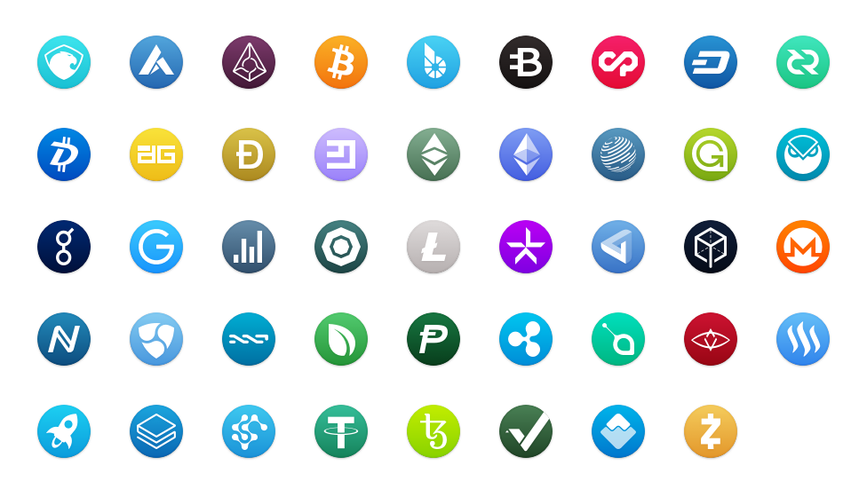
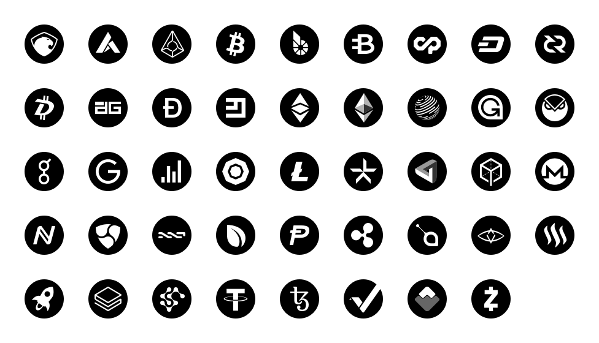

# Cryptocurrency Icons

This download contains over 1000 icons – 67 cryptocurrencies, in 4 styles and a range of sizes. Completely free. All I ask is that you don’t claim them as your own, and share this resource with others.

Images are in the PNG format (transparent) in 32×32, 64×64(@2x), 128×128, and 256×256(@2x) variants, along with SVG versions.

If there is an altcoin you’re looking for that hasn’t been included, please create a new issue and I shall include it.

### Flat

### Icon

### Solid

## Donate

If you find these icons useful, or if you’ve used them for your projects, please consider making a donation.

**Bitcoin**
`1EoTAPJAZSaZjbQwFFmGi8c6HfdLGVkYWq`

**Ethereum**
`0xd301Ad9f4de0B93844724dC3F6ee65C9F3670a6c`

**Litecoin**
`LaZyVy2cJKAynxdANn22P72KVp39X258hG`