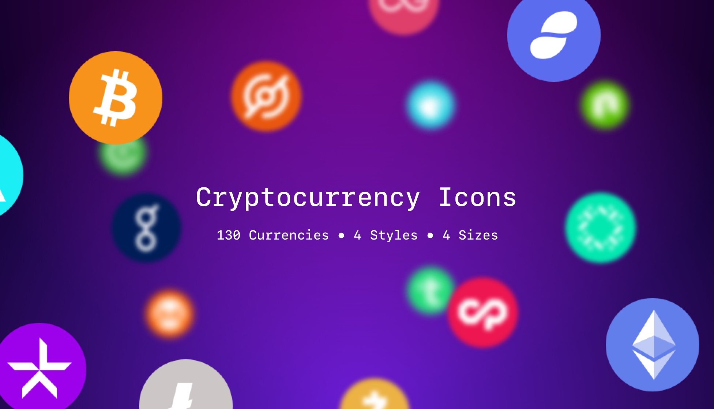

# Cryptocurrency Icons

This download contains over 2000 icons – 161 crypto, and fiat currencies, in 4 styles and a range of sizes. Completely free. All I ask is that you don’t claim them as your own, and share this resource with others.

Images are in the PNG format (transparent) in 32×32, 64×64(@2x), 128×128, and 256×256(@2x) variants, along with SVG versions.

If there is an altcoin you’re looking for that hasn’t been included, please create a new issue and I shall include it.

## Donate

If you find these icons useful, or if you’ve used them for your projects, please consider making a donation. I have invested over 100 hours in creating and maintaining this project, and your donations will help ensure it continues.

**Bitcoin**
`1JoyuwysWLtxd8twdXx6G1ZJ7DHf2jcu8Q`

**Ethereum**
`0x2a47661bc70478D965C0Fb6121309Cc877BD9508`

**Litecoin**
`LW2Nk8T24Dp69DoqaQX2srBGU6jYVx5A9X`

## License

>All icons are licensed under the **Creative Commons Zero (CC0) license**. This means the icons are completely free to be used for any legal purpose.
>
>- The icons are **free** for personal and even for commercial use.
>- You can modify, copy and distribute the icons.
>- All without asking for permission or setting a link to the source. So, **attribution is not required**.
>
>
>The CC0 license was released by the non-profit organization Creative Commons (CC). Get more information about Creative Commons images and the license on the [official license page](https://creativecommons.org/publicdomain/zero/1.0/).
